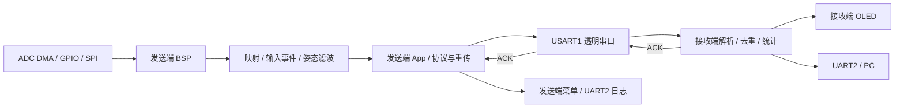
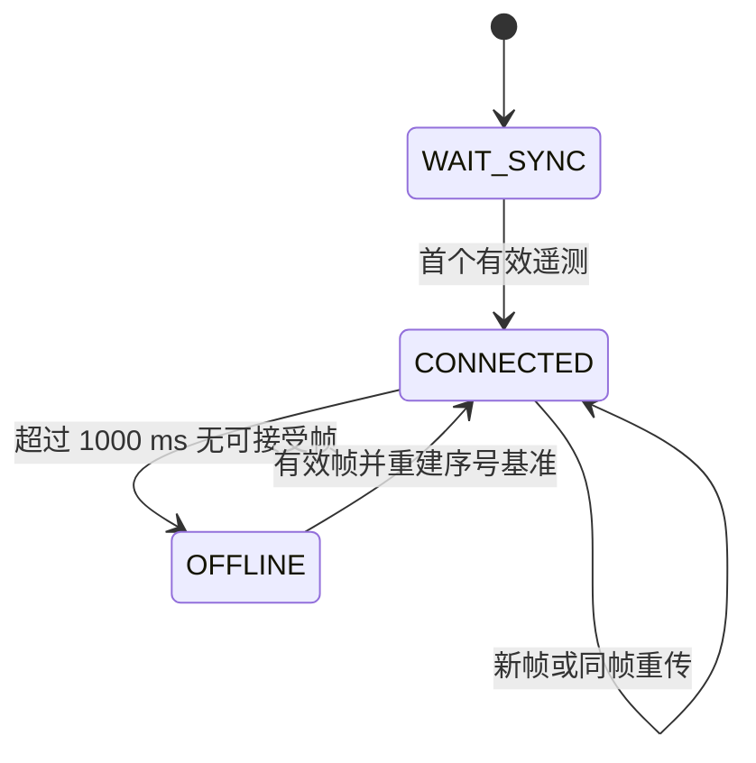

# 实现架构与运行逻辑

[文档导航](README.md) · [硬件连接](hardware-connection.md) · [参数配置](hardware-configuration.md) · [通信协议](protocol.md)

本文描述已经存在的代码，模块 API 以链接到的头文件为准；早期接口草案位于归档。

## 分层与数据流

App 使用 C++17 类组织任务、私有状态和页面；Service 提供协议、输入处理、滤波与统计；BSP 对接 HAL 外设。Core 保留 CubeMX 初始化和中断入口，Drivers 为 ST 库。Service 不依赖 HAL；BSP 的采集适配可复用纯输入服务，不应简单理解为所有头文件都只能沿一条直线依赖。

## 从哪里读代码

| 模块 | 入口或接口 | 职责 |
|---|---|---|
| 发送任务 | [app_sender.h](../sender/App/app_sender.h) | init/task、视图快照、校准与显示计数重置 |
| 菜单 | [app_menu.h](../sender/App/app_menu.h) | 主目录、详情页、导航与动作 |
| 接收任务 | [app_receiver.h](../receiver/App/app_receiver.h) | 接收状态、遥测快照、PC 丢弃计数 |
| 编码与解析 | [srv_protocol.h](../sender/Service/srv_protocol.h) | 遥测/ACK、累加和、token、逐字节解析 |
| 发送可靠性 | [srv_link.h](../sender/Service/srv_link.h) | submit/poll/ack、待确认快照、重试与过期 |
| 输入处理 | [srv_input.h](../sender/Service/srv_input.h) | 按键事件、掩码、摇杆映射 |
| 姿态滤波 | [srv_imu_filter.h](../sender/Service/srv_imu_filter.h) | 原始样本、dt、校准、滤波与原始倾角 |
| 通信统计 | [srv_stats.h](../receiver/Service/srv_stats.h) | 新帧/重复/过期分类，按实际时长结算 |
| UART | [bsp_usart.h](../sender/BSP/bsp_usart.h) | 接收环形缓冲、发送副本、错误恢复 |
| 摇杆 | [bsp_joystick.h](../sender/BSP/bsp_joystick.h) | DMA 采样平均、中心校准、就绪状态 |
| IMU | [bsp_imu.h](../sender/BSP/bsp_imu.h) | 异步初始化、原始读取、状态与恢复 |
| OLED | [bsp_oled.h](../sender/BSP/bsp_oled.h) | 静态显存、绘制、单页刷新、总线恢复 |
| PC 编码 | [srv_pc.h](../receiver/Service/srv_pc.h) | JustFloat 小端编码 |

两端共用逻辑在各自工程中保留独立文件副本；修改协议、配置、UART/OLED 等共用实现时应同步核对。接收 App 使用通用带时间参数的 `protocol_parser_feed`，旧 `srv_protocol_parser` 包装接口保留兼容，不是主业务解析入口。

## C++ 应用与 C 边界

| 应用对象 | C++ 定义 | 保留的 C 入口 |
|---|---|---|
| SenderApplication | [sender_application.hpp](../sender/App/sender_application.hpp) | app_sender_init/task/view 等 |
| SenderMenu | [sender_menu.hpp](../sender/App/sender_menu.hpp) | app_menu_init/render/action 等 |
| ReceiverApplication | [receiver_application.hpp](../receiver/App/receiver_application.hpp) | app_receiver_init/task/telemetry 等 |
| ReceiverUi | [receiver_ui.hpp](../receiver/App/receiver_ui.hpp) | app_ui_init/update |

原文件内静态状态迁入类的私有成员；ReceiverUi 原来无持久状态，仍无新增业务状态。每个模块在静态区有一个零初始化实例，由同名 accessor 返回引用。对象不在构造时调用 HAL，原 init 仍在 Core 的硬件初始化之后执行；不能认为类封装后即可支持多个独立硬件实例，底层 C 服务仍有模块级状态。

main.c 和测试 sim_api.c 保留原调用，通过 extern "C" 桥接到对象方法。旧 app_*.h 是兼容 ABI；新 .hpp 是 C++ 接口。原逻辑、调用次序和计时读点没有改写，详见[迁移说明](cpp-migration.md)。

## 状态与任务

发送端状态来自 [SenderApplication](../sender/App/sender_application.cpp)：

| 状态 | 进入条件与退出方向 |
|---|---|
| INIT | IMU 初始化过程中；就绪后进入校准，失败时降级 |
| CALIBRATING | 静止样本不足或请求重校准；样本合格后继续检查其他外设 |
| NORMAL | IMU 已校准，ADC 与 OLED 就绪 |
| FAULT_DEGRADED | 外设失败；保持其他任务运行，恢复后重新判断状态 |

无线是否在线由独立 `link_online` 表示，不能只根据 NORMAL 判断无线连接。IMU 恢复后重校准；其他外设恢复且 IMU 已校准时可恢复 NORMAL。

过期帧不刷新接收端在线时间。离线时保留最后数据并显示 LOST；上位机通过 link 区分旧快照。

| 任务 | 调度方式 | 说明 |
|---|---|---|
| UART 收取、错误恢复、协议轮询 | 每次主循环 | 中断只搬运字节/置标志，主循环做解析 |
| 按键扫描 | 10 ms | 消抖后生成物理边沿和附加手势 |
| 摇杆/IMU 采样与提交遥测 | 20 ms | 链路忙时跳过提交，不积压全部历史样本 |
| 发送端采样日志 | 100 ms | 独立事件日志优先，串口忙时避免阻塞 |
| OLED | 12/13 ms 交替刷新一页 | 8 页约 100 ms，显存只在帧边界重绘 |
| 接收统计 | 约 1000 ms | 用实际 elapsed_ms 计算 Hz |
| 外设恢复 | 按故障时间戳 | 短事务有 HAL 超时，长等待由状态机推进 |

这些是软件调度周期，不是已测响应时间。发送端周期任务保留相位并跳过错过的周期；接收端 OLED 以本次执行时间重新计时，实际阻塞和迟调度会延长整帧刷新。详细阈值见[配置表](hardware-configuration.md)。

## 数据所有权与并发

| 数据 | 写入者 → 使用者 | 约束 |
|---|---|---|
| UART RX 环形缓冲 | 单 UART ISR → 主循环 | 256 B 存储，保留空槽，可用 255 B；volatile 索引，非通用多线程队列 |
| UART TX 缓冲 | 主循环复制 → HAL 中断发送 | 每端口独占 256 B；忙拒绝，不持有调用者局部变量 |
| ADC DMA 缓冲 | DMA → 主循环 | 256 个半字；中断发布完成半区，主循环平均 64 对 XY 并检查 epoch |
| 待确认遥测 | srv_link → 重传/ACK 匹配 | 保留同一 23 B 快照直到确认/过期，重试不采样替换 |
| OLED 显存 | 主循环绘制 → 主循环页发送 | 静态 `gram[8][128]`，按硬件页连续存储 |
| 事件日志 | 主循环入队 → UART2 | 固定 31 项有效容量，溢出累计可见 |

ADC 平均期间若跨越 DMA 边界，沿用上次一致样本；真实 ADC 故障仍标记未就绪。业务不调用动态内存分配，1 KB 显存不放在局部栈。C++ 类不使用虚函数、异常或 RTTI，静态断言限制为平凡构造/析构；原 C 服务与 HAL 不改为 C++ 编译。

## 姿态解算

MPU6500 输出原始加速度与角速度，BSP 先按配置映射 XYZ。服务层按用户当前基线的 0.8～1.2g 模长范围及角速度/方差条件检查静止，累计 100 个合格样本计算陀螺零偏；有运动或方差不合格时重新开始。初始化姿态使用加速度倾角，随后积分四元数，并在加速度模长接近 1g 时作重力方向校正。

更新使用实际 `dt_s`；无效 dt、归一化与三角函数输入边界均受保护。Pitch/Roll 有重力参考，Yaw 没有磁力计绝对参考，会随积分误差漂移。原始倾角与滤波输出提供给日志做对比，实物滤波参数优化仍需采样验证。

## 故障处理速查

| 条件 | 当前行为 | 可观察信息 |
|---|---|---|
| UART 溢出/接收错误 | 清半帧与旧缓冲，驱动重新挂接接收 | RX 错误计数 |
| 无有效 ACK | 重发同一帧，最多 2 次；到期弃旧样本 | retry / expired / link_online |
| 接收超时 | OFFLINE，清序号基准，保留最后值 | LOST、PC link=0 |
| SPI 错误/设备失联 | IMU 降级并定时重试，恢复后校准 | 遥测 IMU fault / calibrating |
| ADC 错误 | 标记失败并尝试重启采样 | 遥测 ADC fault |
| I2C 错误 | OLED 离线、退避重试；必要时释放总线并重初始化 | 本端 ready / 发送端 OLED fault |
| PC 发送忙 | 丢弃本次转发，继续处理无线 | pc_drop，与无线丢包分开 |

单帧上限、重启静默和序号缺口的适用范围见[协议边界](protocol.md)。
