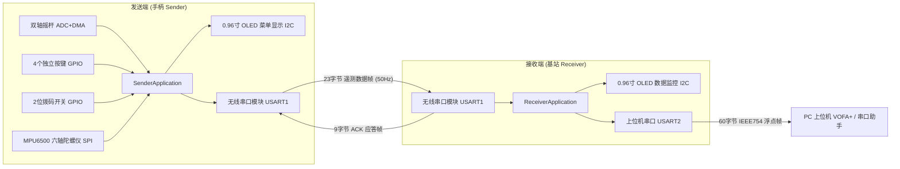

# INVC 无线串口手柄系统代码深度解析与阅读指南

本文档专为帮助理解当前代码库的整体架构、核心设计、算法原理与函数调用链而编写。

---

## 一、 系统全景概览

本项目是一套基于两套 **STM32F103C8T6** 微控制器的无线遥控手柄与接收系统：



---

## 二、 软件分层架构

代码采用严格的分层设计，上层使用现代化 **C++17** 封装状态机与生命周期，底层与算法保持 **C99** 实现，兼顾工程可维护性与嵌入式确定性：

```text
┌────────────────────────────────────────────────────────┐
│ App 应用层 (C++17): SenderApplication / ReceiverUi     │  <- 单例无动态内存分配，主状态机
├────────────────────────────────────────────────────────┤
│ Service 服务层 (C99): srv_protocol / srv_link / filter │  <- 协议编解码、姿态滤波、ARQ、环形缓冲
├────────────────────────────────────────────────────────┤
│ BSP 板级驱动层 (C99): bsp_imu / bsp_joystick / bsp_oled│  <- 传感器通信、ADC DMA、I2C 挂死自愈
├────────────────────────────────────────────────────────┤
│ HAL / 硬件抽象层 (STM32 HAL / CMSIS / STM32F103C8)     │  <- 寄存器与中断
└────────────────────────────────────────────────────────┘
```

---

## 三、 数据帧与通信协议详解

系统通过透明传输无线串口通信，自定义了高度可靠的二进制协议：

### 1. 遥测数据帧 (发送端 -> 接收端，23 字节，50Hz)

| 偏移 | 字段名 | 长度 | 类型 | 含义与范围 |
|---|---|---|---|---|
| `0..1` | 帧头 | 2B | `uint8_t[2]` | 固定 `0xAA 0x55` |
| `2` | 包序号 (SEQ) | 1B | `uint8_t` | `0 ~ 255` 循环自增，支持自然溢出回绕 |
| `3` | 载荷长度 (LEN) | 1B | `uint8_t` | 固定为 `16` (0x10) |
| `4` | 功能码 (CMD) | 1B | `uint8_t` | 固定为 `0x01` (`PROTOCOL_CMD_TELEMETRY`) |
| `5..6` | 摇杆 X 轴 | 2B | `int16_t` | 归一化输出 `-1000 ~ +1000` (小端序) |
| `7..8` | 摇杆 Y 轴 | 2B | `int16_t` | 归一化输出 `-1000 ~ +1000` (小端序) |
| `9..10`| 摇杆 X 电压 | 2B | `uint16_t`| 实际物理采样电压 `0 ~ 3300 mV` |
| `11..12`| 摇杆 Y 电压 | 2B | `uint16_t`| 实际物理采样电压 `0 ~ 3300 mV` |
| `13` | 按键与状态 | 1B | `uint8_t` | 低4位: K1~K4; 高4位: 故障标志 (IMU/ADC/OLED/标定) |
| `14` | 拨码开关 | 1B | `uint8_t` | 低2位: SW1~SW2 状态 |
| `15..16`| 俯仰角 (Pitch)| 2B | `int16_t` | `0.1°` 为单位 (例如 1800 代表 180.0°) |
| `17..18`| 横滚角 (Roll) | 2B | `int16_t` | `0.1°` 为单位 |
| `19..20`| 偏航角 (Yaw)  | 2B | `int16_t` | `0.1°` 为单位 (`0 ~ 3600`) |
| `21` | 累加和校验 | 1B | `uint8_t` | 从 SEQ 到 载荷末尾 (共 19 字节) 的累加和低 8 位 |
| `22` | 帧尾 | 1B | `uint8_t` | 固定 `0x0D` (`\r`) |

### 2. 确认应答帧 ACK (接收端 -> 发送端，9 字节)

| 偏移 | 字段名 | 长度 | 含义 |
|---|---|---|---|
| `0..1` | 帧头 | 2B | 固定 `0xAA 0x55` |
| `2` | 包序号 (SEQ) | 1B | 对应被确认的遥测帧序号 |
| `3` | 载荷长度 | 1B | 固定为 `2` |
| `4` | 功能码 (CMD) | 1B | 固定为 `0x80` (`PROTOCOL_CMD_ACK`) |
| `5..6` | CRC-16 令牌 | 2B | 对原 23 字节遥测全帧计算的 CRC-16/CCITT 令牌 |
| `7` | 累加和校验 | 1B | 对偏移 `2..6` (共 5 字节) 的累加和低 8 位 |
| `8` | 帧尾 | 1B | 固定 `0x0D` |

---

## 四、 核心机制与算法剖析

### 1. 无操作系统 (Bare-metal) 协作式时间片轮询

整个系统未采用 RTOS，而是通过 `due()` 函数保持时间相位，避免累积漂移和突发重放：

```cpp
bool SenderApplication::due(uint32_t now, uint32_t *last, uint32_t period)
{
    if ((uint32_t)(now - *last) < period)
        return false;
    /* 保持时间相位，整除步进，即使单次任务稍有延误也不会造成系统时钟累计漂移 */
    *last += ((uint32_t)(now - *last) / period) * period;
    return true;
}
```

- **10ms**: 按键消抖扫描与状态机步进 (`bsp_key_tick_10ms`)
- **20ms (50Hz)**: 摇杆 ADC 提取、IMU 姿态滤波更新、无线遥测帧打包发射
- **12ms/13ms 交替**: OLED 屏幕 8 页面分片刷新 (单次仅发 128 字节，避免 I2C 阻塞)
- **100ms**: 调试串口输出
- **1000ms**: 接收端丢包率与帧率统计结算窗口、IMU 器件探活

### 2. 停等重传 ARQ (Automatic Repeat reQuest) 与丢包推算

- **发送端 (`srv_link.c`)**:
  - 发送后记录首发时间 `first_ms` 和最近发送时间 `sent_ms`；
  - 80ms 内未收到匹配的 ACK 触发重传 (`retries++`)；
  - 超过最大重传次数 (`LINK_MAX_RETRIES = 2`) 或总寿命超时后，放弃当前帧并递增序号 `seq++`，避免陈旧控制数据阻滞管道。
- **接收端 (`srv_stats.c`)**:
  - 利用 8 位无符号整数减法 `(uint8_t)(seq - last_seq)` 自然处理 0~255 回绕；
  - 差值为 0 且令牌相同判定为重传的**重复包**（回复 ACK 但不向下游转发）；
  - 差值大于 1 则判定中间发生丢包，丢失包数推算为 `diff - 1`；
  - 差值 `>= 128` 判定为历史陈旧包直接丢弃。

### 3. 六轴姿态解算互补滤波与在线零偏标定 (`srv_imu_filter.c`)

- **Welford 在线方差静态检测**:
  在开机或重新标定时，采集 100 组样本。若检测到加速度模长处于 `[0.8g, 1.2g]` 且三轴角速度方差 $< 0.25 (\text{dps})^2$，判定为绝对静止，计算出陀螺仪三轴静态零偏并扣除。
- **四元数 Mahony 互补滤波**:
  利用当前姿态四元数推算重力方向在机体的理论投影向量 $\mathbf{v}$，与加速度计归一化后的实测重力向量 $\mathbf{a}$ 做外积求误差：
  $$\mathbf{e} = \mathbf{a} \times \mathbf{v}$$
  用比例反馈 $K_p \cdot \mathbf{e}$ 补偿角速度，再通过一阶 Runge-Kutta 积分更新四元数并归一化，最后解算为欧拉角。

### 4. 摇杆 ADC DMA 均值滤波与 Epoch 防竞态 (`bsp_joystick.c`)

- ADC1 配合 DMA 循环采样 256 个样本；
- 半传输和全传输中断通过 `complete_half` 翻转和 `epoch++`；
- 主循环计算均值时检查前后 `epoch` 是否一致。若一致表明读取期间没有被 DMA 覆写，计算绝对安全有效；
- 采用分段线性映射：在中心死区 $\pm 80\text{mV}$ 范围内输出 0，其余区间平滑映射至 $[-1000, 1000]$。

### 5. OLED 硬件 I2C 挂死自愈机制 (`bsp_oled.c`)

- 当从机异常导致 SDA 持续拉低使 I2C 总线死锁时，`bsp_oled_bus_unlock` 将 SCL/SDA 引脚临时切换为 GPIO 开漏输出；
- 模拟发出最多 9 个时钟脉冲，促使从机移出正在传输的应答位并释放 SDA；
- 随后执行硬件 I2C 外设复位 (`__HAL_RCC_I2C1_FORCE_RESET`) 并重新初始化。

---

## 五、 重点模块与函数速查表

| 模块文件 | 核心函数 | 功能说明 |
|---|---|---|
| `srv_protocol.c` | `srv_protocol_pack` | 将摇杆、按键、姿态等打包为 23 字节无线数据帧 |
| `srv_protocol.c` | `protocol_parser_feed` | 流式状态机逐字节解析输入，支持杂音中自动滑动对齐帧头 |
| `srv_protocol.c` | `srv_protocol_token` | 计算 23 字节帧的 CRC-16 令牌，用于 ACK 确认 |
| `srv_link.c` | `srv_link_submit` | 提交遥测帧并启动 ARQ 停等追踪 |
| `srv_link.c` | `srv_link_poll` | 轮询重传超时与丢包放弃 |
| `srv_input.c` | `srv_keys_feed` | 4 按键独立消抖、短按/长按/双击状态机 |
| `srv_input.c` | `srv_joystick_map` | 摇杆物理电压转归一化分段线性死区映射 |
| `srv_imu_filter.c` | `srv_imu_filter_update` | 六轴四元数互补滤波与欧拉角更新 |
| `srv_stats.c` | `srv_stats_accept` | 接收包去重、丢包推算与序号追踪 |
| `srv_pc.c` | `srv_pc_pack` | 打包 14 通道 IEEE 754 浮点上位机帧 |
| `bsp_oled.c` | `bsp_oled_update_slice` | 每次仅刷新一页显存，分散 I2C 负荷 |
| `bsp_oled.c` | `bsp_oled_bus_unlock` | I2C 挂死 9 脉冲时钟震荡解锁与外设复位 |
| `sender_application.cpp` | `task` | 发送端主调度：按键扫描、采样、无线通信、菜单与屏幕刷新 |
| `receiver_application.cpp` | `task` | 接收端主调度：无线解包、去重、回复 ACK、转发 PC 上位机 |

---

## 六、 代码未修改与行为一致性验证

为确保本次文档与注释补充工作绝对没有改动任何功能与逻辑，项目建立了严密的双重验证机制：

1. **Token 语法单元完全一致性验证 (`tools/verify_comments_only.py`)**:
   对全部 92 个源码与头文件进行分词对比（剔除注释与空白字符），验证非注释 Token 序列与 Git HEAD 保持 **100% 完全一致**。
2. **自动化软件测试套件 (`tests/run_tests.py`)**:
   包含环形缓冲区回归测试、协议容错测试、驱动模拟测试、多状态机集成测试，测试结果全绿：
   `ALL SOFTWARE CHECKS PASSED (HAL is mocked; physical hardware is untested)`.
3. **固件编译与二进制尺寸对比 (`tools/build_firmware.py`)**:
   使用 GNU Arm 交叉编译器生成的 ELF 固件镜像与修改前保持完全一致：
   - 发送端 Release: Flash 34,212 B, RAM 7,272 B (完全一致)
   - 接收端 Release: Flash 18,716 B, RAM 5,672 B (完全一致)
