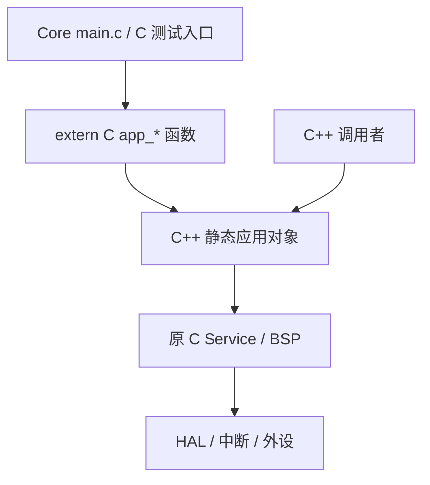

# 应用层 C++ 封装与 C 接口

[文档导航](README.md) · [构建与复测](quick-start.md) · [验证记录](records/2026-10-04-cpp-refactor.md)

## 范围

本次将四个 App 模块的实现迁为 C++17，将持久状态和操作归入对象。原 C 应用实现被替换，不是套一个空类转调旧 App C 文件；Service/BSP/Core/HAL 继续用 C，协议、滤波、重传和硬件回调不重写。

| 原实现 | 新实现 | 对象及主要接口 |
|---|---|---|
| sender/App/app_sender.c | [sender_application.cpp](../sender/App/sender_application.cpp)、[.hpp](../sender/App/sender_application.hpp) | SenderApplication：init/task/snapshot/recalibrate |
| sender/App/app_menu.c | [sender_menu.cpp](../sender/App/sender_menu.cpp)、[.hpp](../sender/App/sender_menu.hpp) | SenderMenu：navigate_up/down、enter/back/long_press、render |
| receiver/App/app_receiver.c | [receiver_application.cpp](../receiver/App/receiver_application.cpp)、[.hpp](../receiver/App/receiver_application.hpp) | ReceiverApplication：init/task/snapshot/forwarding_drops |
| receiver/App/app_ui.c | [receiver_ui.cpp](../receiver/App/receiver_ui.cpp)、[.hpp](../receiver/App/receiver_ui.hpp) | ReceiverUi：init/update；保持无持久业务状态 |

命名空间分别为 `invc::sender`、`invc::receiver`。旧 app_*.h 保留 C 接口和原数据结构，C/C++ 共用的枚举和值保持不变；没有为使用 enum class 而改动协议、状态值或 ABI。

## 调用与生命周期



每个对象在 `.cpp` 静态存储区用 `{}` 零初始化，通过 accessor 返回引用。构造/析构保持平凡，没有全局构造函数访问硬件、堆分配、虚函数、RTTI 或异常；编译期断言检查平凡构造和析构。复制与复制赋值被禁用。

硬件初始化仍由现有 Core 完成后调用 init；重复 init 的重置范围也沿用原逻辑，没有额外把所有成员重新清零。底层 C 服务依旧有模块级状态，因此使用提供的唯一实例，不应创建多个应用实例假设硬件和滤波状态独立。

原 main.c 无需改写：

```c
app_sender_init();
/* 原主循环中的位置不变 */
app_sender_task();
```

在 C++ 调用者中，可通过对象接口使用同一个实例：

```cpp
#include "sender_application.hpp"
auto& app = invc::sender::sender_application();
// 在原初始化时点调用一次 init；主循环只使用一种入口调用 task。
app.init();
app.task();
```

这个示例用于说明入口，不能在现有 main 已调用 C 桥接的同时再重复调用 task/init。新 .hpp 已处理所需 C 头文件的语言链接；如直接在其他 C++ 文件中包含仍无 C++ guards 的 C 服务头，应放在 extern "C" 块中。

## 保持不变的内容

原判断、循环、调用顺序、计时读点、浮点表达式、缓冲容量、字符串格式和序列化没有调整。文件内静态状态迁入成员；原函数体仅将本模块入口调用重命名为对应成员方法。跨模块调用继续经过已保留的 C 接口，避免扩大重构范围。

当前磁盘版本是唯一基线，包括用户把 IMU 校准模长放宽为 0.8～1.2g 的调整。VS Code 配置、CMake Presets、工具链、链接脚本和生成代码均保留；双方 CMake 仅更换 App 源清单并明确 C++17。

## 怎样验证

1. 重构前完整快照运行原测试、CMake Release/Debug，记录基线。
2. 同一套原测试通过 C ABI 调用新 C++ App，测试断言保持原样。
3. 独立加载基线/新实现 DLL，以同输入、同 tick、同模拟 HAL 回调比较每一步状态、每条 UART 数据和 OLED 显存。
4. 对照新旧 Flash/RAM、检查无新增 C++ 动态初始化/异常/分配符号，核对所有保留层源码哈希。

覆盖丢包/损坏/分片/重复、按键、校准与外设故障、PC 模式切换、UART 忙、单端重启、序号和 tick 回绕。结果与局限见[记录](records/2026-10-04-cpp-refactor.md)。这证明所测路径行为一致，不能推出新版在实物上每条指令耗时完全相同；二进制与链接尺寸允许变化。
