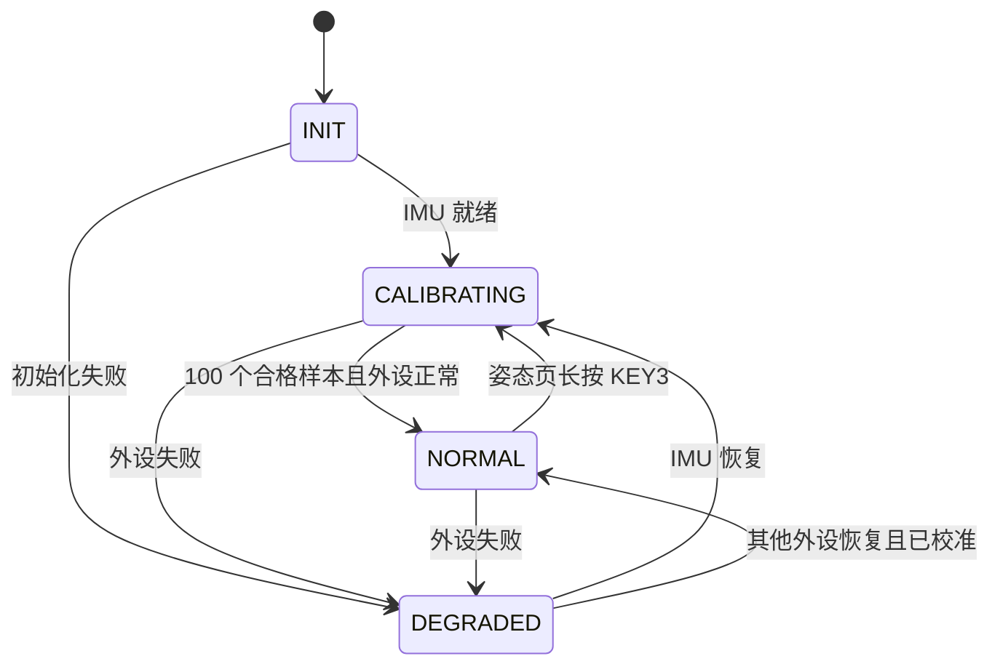

# INVC ⑪～⑭ 软件实现与验证记录

[文档导航](../README.md) · [当前状态](../project-status.md)

> 本文为日期快照；“当前”“待实现”等措辞指记录当天。历史文件清单保留当时路径；迁移后的入口见[重命名对照](2026-09-18-docs-refactor.md)。

日期：2026-09-18。目标项目：`C:/Users/34118/Desktop/invc_exam/project/`。

本次按用户指定顺序推进各阶段，每阶段先完成对应实现与测试，再进入下一阶段。以下记录代码事实与模拟实验；未连接硬件、未烧录，不替代上板验收或用户个人考核报告。

## 一、按阶段交付

| 步骤 | 已完成 | 验证方式与结果 |
|---|---|---|
| ⑪ 状态机与关键逻辑 | 流式协议、ACK/重试/过期、按键四事件、摇杆映射、IMU 静止校准/四元数滤波、去重/缺包统计 | 主机 C 测试通过；每种帧切分、逐字节损坏、噪声恢复、时间/序号回绕、重传边界、长按/双击、姿态输入 |
| ⑫ 驱动层实现与验证 | UART 双向 IT、ADC 双半区 DMA、GPIO、MPU6500 原始寄存器 SPI、SSD1306 硬件 I2C、超时恢复 | Mock HAL 驱动测试通过；TX 数据所有权、忙/超时、RX 溢出、ADC、引脚、SPI 配置/故障、OLED 页/边界/恢复 |
| ⑬ 业务层实现 | Sender/Receiver 主循环、多级菜单、生命周期/离线状态、事件日志、PC 文本/JustFloat、故障标志 | 两端实际 App+BSP+Service 运行在 HAL 模拟中；启动、校准、降级恢复、菜单、去重、PC 格式/背压、接收端重启测试通过 |
| ⑭ 软件联调与优化 | 双端模拟链路、带限重传、启动重新同步、显示布局与资源核验、可复测构建脚本 | 正常/丢包/ACK 丢失/断链/发送端重启/序号回绕/SysTick 回绕通过；两端 GNU Arm 完整编译链接通过 |

## 二、结构与关键路径

保留原工程层次：`Core/Drivers → BSP → Service/App`。App 使用 Service 和 BSP；算法及协议服务不包含 HAL 头文件；BSP 的 GPIO/ADC 采集复用纯输入服务。没有 RTOS 或业务动态内存。

发送路径：ADC DMA 完成半区 → 主循环平均与中心/死区映射；GPIO → 去抖事件/稳态开关；SPI 原始六轴 → 100 样本静止校准 → 重力校正四元数 → 最新遥测 → 单帧停止等待链路。独立 UART2 日志与 OLED 分页任务持续运行。

接收路径：UART1 字节中断 → 255 字节有效容量环形缓冲 → 主循环滑动解析 → 长度/功能/校验/范围检查 → 新帧/重复/过期分类 → 新帧更新快照并转发 PC，重复只 ACK → 定时统计与 OLED。

接收端为 WAIT_SYNC / CONNECTED / OFFLINE。离线保留最后值供诊断，并明确显示 LOST、PC link=0。故障传感器值不能脱离故障标志当作有效测量使用。

## 三、本次修复与设计取舍

1. **原业务骨架未实现**：补全采集、调度、显示、解析与转发，main.c 只调用 App 初始化/任务。
2. **异步发送生命周期**：UART 发送复制到端口独有静态缓冲，避免局部变量失效/重传时改写待发数据；忙返回失败并计数，100 ms 未完成执行中止恢复。
3. **解析恢复和重复执行**：严格检查 16/2 字节长度及 cmd，损坏后滑动重同步；匹配 seq+原帧 CRC16 token，重复帧 ACK 但不二次转发或算新包。
4. **迟到重传延长旧样本寿命**：加入从首次发送计时的 240 ms 上限，不让局部 busy 或延迟重试无限保留旧控制样本。
5. **发送端重启误算丢包**：联调中曾发现旧序号与重启后的 0 比较产生虚假丢包；加入 1500 ms 启动静默，让接收端先超时清序号基准。当前模拟通过，实际无线缓存延迟仍需验证。
6. **按键三击/记录完整性**：避免相邻双击重叠；日志独立排队保留 PRESS/RELEASE/LONG/DOUBLE，31 项固定有效容量并输出溢出计数。双击是附加手势而非否定已发生的物理 PRESS。
7. **ADC 一致性**：256 个半字的 DMA 循环缓冲分半区，每次对完整 64 对 XY 平均，使用 epoch 检查采样期间 DMA 边界；边界竞争保留上次一致值，不伪造瞬间零值；真正故障仍上报标志并重试。
8. **开关抖动**：主循环采样变化稳定 60 ms 后发布，每路独立计时。
9. **SPI 配置速率错误**：用户提供的 MPU6500 Product Specification / Register Map 明确一般寄存器 SPI 访问上限 1 MHz；BSP 将原 /8（9 MHz）覆盖为 /128（562.5 kHz），第一次访问前生效。
10. **MPU6500 库取舍**：供应的完整 LibDriver 核心含 DMP 固件/接口，basic 初始化含等待。采用小型原始寄存器初始化状态机（WHO_AM_I、复位、配置回读、采样就绪、故障恢复），不编译第三方 DMP，不修改第三方源码。量程与滤波参数有本地手册依据。
11. **菜单取舍**：使用静态主目录+四类详情页，以满足层级交互和资源预算；没有导入 MiaoUI 的动态对象、RTOS 或文件系统。复用现有 OLED 例程的必要 ASCII 字库；I2C 传输使用 HAL 硬件接口，总线释放脉冲只用于故障恢复。
12. **PC 统计帧虚增频率**：在线 JustFloat 每新遥测仅发一帧，统计随下一帧，去掉额外在线周期快照。等待/离线快照 link=0，文本 `STAT` 与 `R` 有明确类别。PC 忙时允许丢转发且可计数，不阻塞无线。
13. **工程可重生成与复测**：新增接收端 USART2 IRQ，仅编辑 Core 的 USER CODE 区；运行时 BSP 调整 NVIC/SPI；两端 Keil 工程纳入所有实际源文件，另提供 GNU Arm 脚本可直接生成固件。

## 四、测试证据

`python tests/run_tests.py` 所有软件检查通过。`-Wall -Wextra -Werror`，没有隐藏 misleading-indentation 告警。纯逻辑覆盖固定帧向量、全部分包切点、23 个逐字节损坏位置、1000 轮随机噪声恢复、错误/重复 ACK、超时/重试、模 256 和 tick 回绕、输入映射、四种按键事件、静止/旋转/异常姿态样本等。

双端集成运行的是两端实际 App/BSP/Service，仅 HAL 与串口传输介质模拟；测试设定每方向链路延迟 4 ms，不能当作无线模块实测。结果如下：

| 场景 | 模拟时长 ms | 新包 | 重复包 | 发送端重试 | 发送端过期 | 最后窗口新包 Hz |
|---|---:|---:|---:|---:|---:|---:|
| 正常链路/序号回绕 | 7000 | 275 | 0 | 0 | 0 | 50.0 |
| 损坏数据/丢数据/丢 ACK | 9000 | 215 | 13 | 40 | 0 | 27.0 |
| 1.6 秒断链后恢复 | 10000 | 345 | 0 | 14 | 6 | 50.0 |
| 发送端独立重启 | 11000 | 400 | 0 | 0 | 0 | 50.0 |
| 32 位计时回绕 | 7000 | 275 | 0 | 0 | 0 | 50.0 |

集成测试逐帧检查 JustFloat 帧长/尾标/数值范围，并断言在线 PC 新包数与接收端 unique 数量扣除转发丢弃一致。断链场景中最终推算缺包为 0，并不意味着没有断链：接收端离线后主动重建序号基准，缺失数量不可恢复；发送端过期计数与离线状态才记录该次异常。

额外测试确认 PC 串口忙时仍处理无线并 ACK，后续新值可继续转发；接收端自身重启后可从任意发送 seq 建立基准；启动/校准/IMU 故障恢复不停止其他任务。

`python tests/render_screens.py` 由实际应用显存输出六页预览，已人工检查常用值和菜单文字没有越界裁剪。这是像素布局检查，不是屏幕通电测试。

## 五、编译与资源

`python tools/build_firmware.py` 编译原 HAL/CMSIS/Core 与全部业务 C 源，并完整链接 Cortex-M3 Thumb、soft-float 固件。生成 HEX/BIN/ELF/MAP 和各编译单元 .su 文件。

| 目标 | Flash（64 KB 上限） | RAM（20 KB 上限） |
|---|---:|---:|
| sender | 34,224 B / 52.22% | 6,928 B / 33.83% |
| receiver | 18,724 B / 28.57% | 5,328 B / 26.02% |

RAM 数值包括静态数据、512 B 堆预留和 2,048 B 栈预算；不等于动态最坏栈测量。无需为整数日志链接 printf 浮点格式库。保留 Keil 项目但本机没有执行 Keil 编译器，不能将上述结果冒称为 Keil 构建结果。

另外确认：所有 Core 生成区域与原项目一致；ST Drivers 和 .ioc 内容未改；两端共用协议/配置/UART/OLED 实现一致；Keil 源路径均存在，无重复注册；未改 .vscode、原始题目与第三方参考目录。

## 六、运行与复测入口

按键和 PC 通道见[操作与上位机](../user-guide.md)，复测见[构建说明](../quick-start.md)，协议见[通信协议](../protocol.md)。[实施文件清单](2026-09-18-software-files.json)保留当时路径。

主要入口：sender/App/app_sender.c、sender/App/app_menu.c、receiver/App/app_receiver.c、receiver/App/app_ui.c；关键配置为双方 Service/system_config.h。纯逻辑优先通过 tests/test_logic.c 复测，驱动改动加跑 test_drivers.c，业务与通信修改运行完整 run_tests.py。

## 七、边界与之后的硬件工作

本次软件范围已完成，硬件联调按用户要求不执行。以下是待测项，不是已经达标的结论：ADC 电压误差与噪声、机械中心/实际参考电压、IMU 安装方向和长期漂移、真实无线 RTT/缓存/反向 ACK、面包板 I2C/SPI 信号质量、任务最坏耗时与栈深、真实 OLED 和 PC 串口/VOFA+。

当前默认目标为正常链路 50 Hz、OLED 约 10 Hz，异常下任务有界退避。HAL 短事务仍有超时等待，不声称完全零阻塞。旧设计中的所有动作 ≤50 ms 可见、切页 ≤100 ms、滤波后某固定角度精度属于未经实测的目标；分页显示完成可能超过这些旧目标。

6 轴算法无磁力计，Yaw 是相对角而非绝对方位。CRC16 token 与 8 位 seq 不是唯一会话 ID；启动静默只针对有限缓存时延下的重启，不能消除任意陈旧帧/CRC 碰撞。长时间断链无法用 8 位序号精确重建全部丢失帧数。上述取舍已在代码、协议和测试中保持一致。
